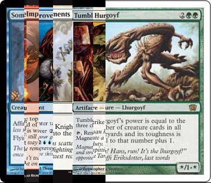

# MTG Meme Generator

So I assume if you're here you've seen those Magic memes flying around recently. You know the ones, cards stitched together to make custom text. Well a lot of us are less inclined to make those without a generator (read lazy). To help fix this horrendous lack of meme creators there's a generator here to use.

When run it'll output Several images in the directory you are in. Result.jpg will be the final result. There will also be several ImageX.jpg and CroppedX.jpg images which are the components it built your image from. If it didn't come out quite right you can use these to modify it a little.

It will automatically make sure no one card has text from multiple words coming from it and make sure the first and last cards include the left and right borders respectively automatically. Most of the error warnings should be self explanatory. Be warned it can take a while to run since it is doing many complicated requests to the gathering website.

Now you might be thinking you aren't technical so probably can't use just any fancy generators, for you here are some instructions to get you going.

First somewhere on this page there should be a download zip button. You can use that to download all the code and the font to start making your own memes. 

##Windows instructions

Now to run these you'll need something called python. This is installed by default in most linux and OS X machines. For windows you can get it from the [python website](https://www.python.org/downloads/release/python-2712/) just download the x86\_64 msi installer and it will take care of the rest, ensure you make a note of where it installs.

Once it is installed you'll need to open the command prompt. This can be found by typing in cmd in the windows menu.

It will appear as a black text box

The first command you'll need to run is `cd C:\Python27\Scripts` Where `C:\Python27` should be replaced with where you installed python

Then you can run `pip install bs4 pillow` which will install some packages needed to run the script.

Now you are ready to run the script. run `cd C:\MemeGen` where `C:\MemeGen` is where you extracted the code and font

Then run `C:\Python27\python.exe memeGen.py I got it working` where `I got it working` is the text you'd like on the cards.

##Mac and Linux instructions

Your computer probably already has python istalled if not you can get it from the [python website](https://www.python.org/downloads/release/python-2712/) or your package manager.

Once it is installed open the terminal and run `cd ~/MemeGen` Where `~/MemeGen` is where you extracted the code and font(`~` means your home directory)

Now you can run the code with `python MemeGen.py I got it working` where `I got it working` is the text you'd like on the cards.
